# Case Study <a name=case_study></a>

## Table of Contents
1. [Percentage of powerlifter's gender](#gender_count)
2. [The number of powerlifter that join the meet within 5 year range (Separated by the gender)](#count_powerlifter)
    1. [The Number of Male Powerlifter](#count_male)
    2. [The Number of Female Powerlifter](#count_female)
    3. [The Number of Neutral Gender Powerlifter](#count_neutral)
3. [Percentage of each event respectively to the total event](#count_event)
4. [Percentage of successful lift in SBD (for each lift)](#success_lift)
    1. [Successful Squat](#success_squat)
    2. [Successful Bench](#success_bench)
    3. [Successful Deadlift](#success_deadlift)
    4. [Compare All Lift](#all_lift)
5. [The average best lift for each 5 year (for each lift)](#avg_lift)
    1. [Average Best Squat](#avg_squat)
        1. [Average Best Squat for Male](#avg_squat_male)
        2. [Average Best Squat for Female](#avg_squat_female)
        3. [Average Best Squat for Neutral Gender](#avg_squat_neutral)
    2. [Average Best Bench](#avg_bench)
        1. [Average Best Bench for Male](#avg_bench_male)
        2. [Average Best Bench for Female](#avg_bench_female)
        3. [Average Best Bench for Neutral Gender](#avg_bench_neutral)
    3. [Average Best Deadlift](#avg_deadlift)
        1. [Average Best Deadlift for Male](#avg_deadlift_male)
        2. [Average Best Deadlift for Female](#avg_deadlift_female)
        3. [Average Best Deadlift for Neutral Gender](#avg_deadlift_neutral)

## Percentage of powerlifter's gender <a name=gender_count></a>
Because some participants name occurs more than one, first we query the unique participant `name` and their `sex`, after that we use `COUNT(*)`.
```sql
WITH
unique_participants AS (
    SELECT
        DISTINCT name,
        sex
    FROM powerlift_data
),
unique_gender AS (
    SELECT
        sex,
        COUNT(*) AS count_gender
    FROM unique_participants
    GROUP BY sex
)

SELECT
    sex,
    count_gender,
    ROUND(count_gender / SUM(count_gender) OVER() * 100, 3) AS percentage
FROM unique_gender
ORDER BY percentage DESC;
```
Output:
|sex|count_gender|percentage|
|---|------------|----------|
|M  |563885      |75.171    |
|F  |186227      |24.826    |
|Mx |27          |0.004     |

It's clearly that male gender dominated the powerlifting meet, while neutral gender is not very common in powerlifting meet.

## The number of powerlifter that join the meet within 5 year range (Separated by the gender)<a name=count_powerlifter></a>
```sql
CREATE TABLE count_powerlifter(
    year_range VARCHAR,
    sex VARCHAR,
    total_powerlifter INTEGER
);

INSERT INTO count_powerlifter(
    year_range,
    sex,
    total_powerlifter
)
WITH
unique_powerlifter AS (
    SELECT
        DISTINCT name,
        sex,
        MIN(date)  AS join_year
    FROM powerlift_data
    GROUP BY
        name,
        sex
)
SELECT
    CONCAT(MIN(DATE_PART('year', join_year))::VARCHAR, '-', MAX(DATE_PART('year', join_year))::VARCHAR) AS year_range,
    sex,
    COUNT(*) AS total_powerlifter
FROM unique_powerlifter
GROUP BY
    FLOOR(DATE_PART('year', join_year)/5),
    sex;
```
Output:
> INSERT successfully executed. 25 rows were affected.

### The Number of Male Powerlifter <a name=count_male></a>
```sql
SELECT
    year_range,
    total_powerlifter
FROM count_powerlifter
WHERE sex = 'M'
ORDER BY year_range;
```
Output:
|year_range|total_powerlifter|
|----------|-----------------|
|1964-1964 |39               |
|1965-1969 |225              |
|1970-1974 |587              |
|1975-1979 |3426             |
|1980-1984 |41206            |
|1985-1989 |15702            |
|1990-1994 |15859            |
|1995-1999 |22158            |
|2000-2004 |33699            |
|2005-2009 |41029            |
|2010-2014 |116085           |
|2015-2019 |183392           |
|2020-2023 |90478            |

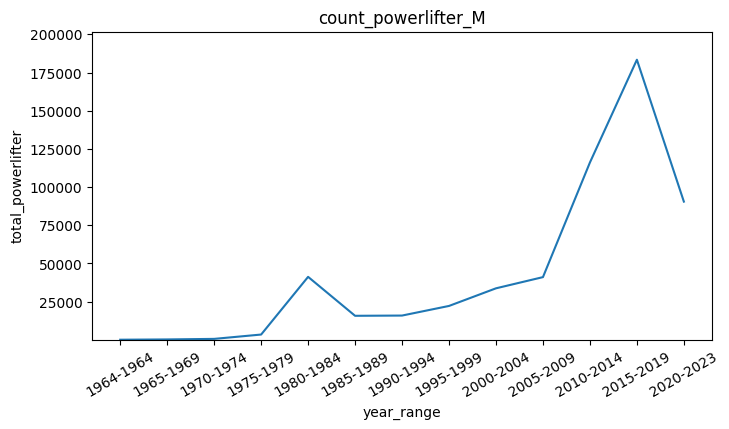

### The Number of Female Powerlifter <a name=count_female></a>
```sql
SELECT
    year_range,
    total_powerlifter
FROM count_powerlifter
WHERE sex = 'F'
ORDER BY year_range;
```
Output:
|year_range|total_powerlifter|
|----------|-----------------|
|1975-1979 |188              |
|1980-1984 |4427             |
|1985-1989 |2708             |
|1990-1994 |3292             |
|1995-1999 |5052             |
|2000-2004 |7199             |
|2005-2009 |7987             |
|2010-2014 |25286            |
|2015-2019 |86962            |
|2020-2023 |43126            |

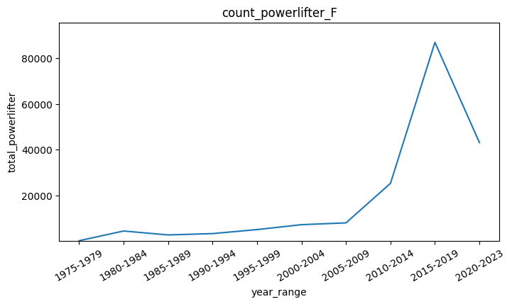

### The Number of Neutral Gender Powerlifter <a name=count_neutral></a>
```sql
SELECT
    year_range,
    total_powerlifter
FROM count_powerlifter
WHERE sex = 'Mx'
ORDER BY year_range;
```
Output:
|year_range|total_powerlifter|
|----------|-----------------|
|2016-2019 |8                |
|2020-2023 |19               |

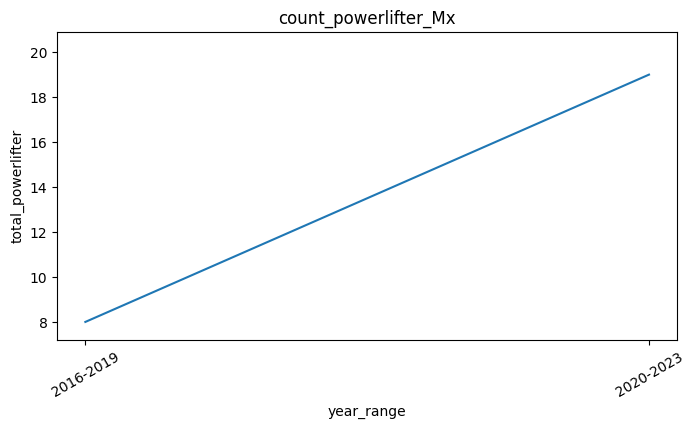

## Percentage of each event respectively to the total event <a name=count_event></a>
```sql
WITH
unique_event AS (
    SELECT
        event,
        COUNT(*) AS count_event
    FROM powerlift_data
    GROUP BY event
)

SELECT
    event,
    count_event,
    ROUND(count_event / SUM(count_event) OVER() * 100, 3) AS percentage
FROM unique_event
ORDER BY percentage DESC;
```
Output:
|event|count_event|percentage|
|-----|-----------|----------|
|SBD  |1970821    |69.009    |
|B    |645043     |22.586    |
|D    |164047     |5.744     |
|BD   |56006      |1.961     |
|S    |15233      |0.533     |
|SB   |2922       |0.102     |
|SD   |1820       |0.064     |

## Percentage of successful lift in SBD (for each lift) <a name=success_lift></a>

First, we create table called `success_lift` that contains lift name followed by lift percentage, then we will query each lift, one by one, and insert it into the table.

```sql
CREATE TABLE lift_percentage (
    lift VARCHAR,
    lift_1_percent NUMERIC,
    lift_2_percent NUMERIC,
    lift_3_percent NUMERIC
);
```
Output:
> CREATE successfully executed.

### Successful Squat <a name=success_squat></a>
```sql
INSERT INTO lift_percentage(
    lift,
    lift_1_percent,
    lift_2_percent,
    lift_3_percent
)
WITH
sbd_squat AS (
    SELECT
        squat1kg,
        squat2kg,
        squat3kg
    FROM powerlift_data
    WHERE event = 'SBD'
)
SELECT
    'squat' AS lift,
    ROUND(
        (SELECT
            COUNT(squat1kg) FROM sbd_squat WHERE squat1kg > 0
        ) / COUNT(squat1kg)::NUMERIC*100, 2
    ) AS lift_1_percent,
    
    ROUND(
        (SELECT
            COUNT(squat2kg) FROM sbd_squat WHERE squat2kg > 0
        ) / COUNT(squat2kg)::NUMERIC*100, 2
    ) AS lift_2_percent,

    ROUND(
        (SELECT
            COUNT(squat3kg) FROM sbd_squat WHERE squat3kg > 0
        ) / COUNT(squat3kg)::NUMERIC*100, 2
    ) AS lift_3_percent
FROM sbd_squat;
```
Output:
> INSERT successfully executed. 1 rows were affected.

### Successful Bench <a name=success_bench></a>
```sql
INSERT INTO lift_percentage(
    lift,
    lift_1_percent,
    lift_2_percent,
    lift_3_percent
)
WITH
sbd_bench AS (
    SELECT
        bench1kg,
        bench2kg,
        bench3kg
    FROM powerlift_data
    WHERE event = 'SBD'
)
SELECT
    'bench' AS lift,
    ROUND(
        (SELECT
            COUNT(bench1kg) FROM sbd_bench WHERE bench1kg > 0
        ) / COUNT(bench1kg)::NUMERIC*100, 2
    ) AS lift_1_percent,
    
    ROUND(
        (SELECT
            COUNT(bench2kg) FROM sbd_bench WHERE bench2kg > 0
        ) / COUNT(bench2kg)::NUMERIC*100, 2
    ) AS lift_2_percent,

    ROUND(
        (SELECT
            COUNT(bench3kg) FROM sbd_bench WHERE bench3kg > 0
        ) / COUNT(bench3kg)::NUMERIC*100, 2
    ) AS lift_3_percent
FROM sbd_bench;
```
Output:
> INSERT successfully executed. 1 rows were affected.

### Successful Deadlift <a name=success_deadlift></a>
```sql
INSERT INTO lift_percentage(
    lift,
    lift_1_percent,
    lift_2_percent,
    lift_3_percent
)
WITH
sbd_deadlift AS (
    SELECT
        deadlift1kg,
        deadlift2kg,
        deadlift3kg
    FROM powerlift_data
    WHERE event = 'SBD'
)
SELECT
    'deadlift' AS lift,
    ROUND(
        (SELECT
            COUNT(deadlift1kg) FROM sbd_deadlift WHERE deadlift1kg > 0
        ) / COUNT(deadlift1kg)::NUMERIC*100, 2
    ) AS lift_1_percent,
    
    ROUND(
        (SELECT
            COUNT(deadlift2kg) FROM sbd_deadlift WHERE deadlift2kg > 0
        ) / COUNT(deadlift2kg)::NUMERIC*100, 2
    ) AS lift_2_percent,

    ROUND(
        (SELECT
            COUNT(deadlift3kg) FROM sbd_deadlift WHERE deadlift3kg > 0
        ) / COUNT(deadlift3kg)::NUMERIC*100, 2
    ) AS lift_3_percent
FROM sbd_deadlift;
```
Output:
> INSERT successfully executed. 1 rows were affected.

### Compare All Lift <a name=all_lift></a>

```sql
SELECT *
FROM lift_percentage;
```
Output:
|lift|lift_1_percent|lift_2_percent|lift_3_percent|
|----|--------------|--------------|--------------|
|squat|85.19         |78.79         |61.87         |
|bench|89.60         |77.04         |45.85         |
|deadlift|94.53         |85.92         |58.68         |

All successful lift decrease proportionally to the lift attempt.

## The average best lift for each 5 year (for each lift) <a name=avg_lift></a>
First, we will query for each lift and export it into [query_csv](query_csv), then we will plot it by using [plot_best_average script](plot_best_average.py) and save it into [plot_graph](plot_graph).

### Average Best Squat <a name=avg_squat></a>
```sql
CREATE TABLE avg_best_squat(
    year_range VARCHAR,
    sex VARCHAR,
    average_squat NUMERIC
);

INSERT INTO avg_best_squat(
    year_range,
    sex,
    average_squat
)
SELECT
    CONCAT(MIN(DATE_PART('year', date))::VARCHAR, '-', MAX(DATE_PART('year', date))::VARCHAR) AS year_range,
    sex,
    ROUND(AVG(best3squatkg), 2) AS average_squat
FROM powerlift_data
WHERE
    best3squatkg > 0
GROUP BY
    FLOOR(DATE_PART('year', date)/5),
    sex
```
Output:
> INSERT successfully executed. 25 rows were affected.

#### Average Best Squat for Male <a name=avg_squat_male></a>
```sql
SELECT
    year_range,
    average_squat
FROM avg_best_squat
WHERE sex = 'M'
ORDER BY year_range;
```
Output:
|year_range|average_squat|
|----------|-------------|
|1964-1964 |190.29       |
|1965-1969 |208.90       |
|1970-1974 |199.12       |
|1975-1979 |197.73       |
|1980-1984 |201.43       |
|1985-1989 |222.01       |
|1990-1994 |223.54       |
|1995-1999 |221.22       |
|2000-2004 |218.80       |
|2005-2009 |224.29       |
|2010-2014 |189.90       |
|2015-2019 |193.27       |
|2020-2023 |194.70       |

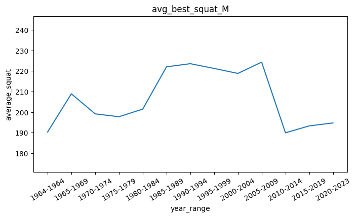

#### Average Best Squat for Female <a name=avg_squat_female></a>
```sql
SELECT
    year_range,
    average_squat
FROM avg_best_squat
WHERE sex = 'F'
ORDER BY year_range;
```
Output:
|year_range|average_squat|
|----------|-------------|
|1975-1979 |84.07        |
|1980-1984 |101.96       |
|1985-1989 |122.06       |
|1990-1994 |124.99       |
|1995-1999 |127.06       |
|2000-2004 |128.13       |
|2005-2009 |128.58       |
|2010-2014 |110.13       |
|2015-2019 |111.25       |
|2020-2023 |116.09       |

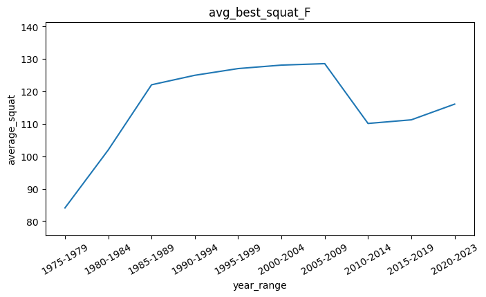

#### Average Best Squat for Neutral Gender <a name=avg_squat_neutral></a>
```sql
SELECT
    year_range,
    average_squat
FROM avg_best_squat
WHERE sex = 'Mx'
ORDER BY year_range;
```
Output:
|year_range|average_squat|
|----------|-------------|
|2017-2019 |103.66       |
|2020-2023 |105.55       |

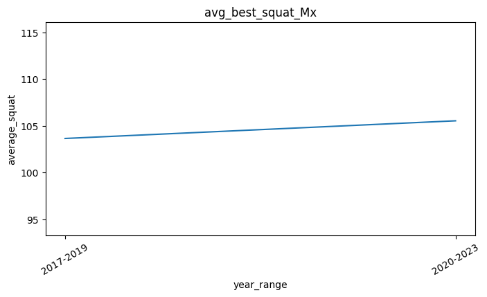

### Average Best Bench <a name=avg_bench></a>
```sql
CREATE TABLE avg_best_bench(
    year_range VARCHAR,
    sex VARCHAR,
    average_bench NUMERIC
);

INSERT INTO avg_best_bench(
    year_range,
    sex,
    average_bench
)
SELECT
    CONCAT(MIN(DATE_PART('year', date))::VARCHAR, '-', MAX(DATE_PART('year', date))::VARCHAR) AS year_range,
    sex,
    ROUND(AVG(best3benchkg), 2) AS average_bench
FROM powerlift_data
WHERE
    best3benchkg > 0
GROUP BY
    FLOOR(DATE_PART('year', date)/5),
    sex;
```
Output:
> INSERT successfully executed. 25 rows were affected.

#### Average Best Bench for Male <a name=avg_bench_male></a>
```sql
SELECT
    year_range,
    average_bench
FROM avg_best_bench
WHERE sex = 'M'
ORDER BY year_range;
```
Output:
|year_range|average_bench|
|----------|-------------|
|1964-1964 |127.32       |
|1965-1969 |143.14       |
|1970-1974 |134.55       |
|1975-1979 |132.10       |
|1980-1984 |134.09       |
|1985-1989 |143.55       |
|1990-1994 |144.40       |
|1995-1999 |150.00       |
|2000-2004 |149.55       |
|2005-2009 |158.10       |
|2010-2014 |134.88       |
|2015-2019 |135.13       |
|2020-2023 |131.36       |

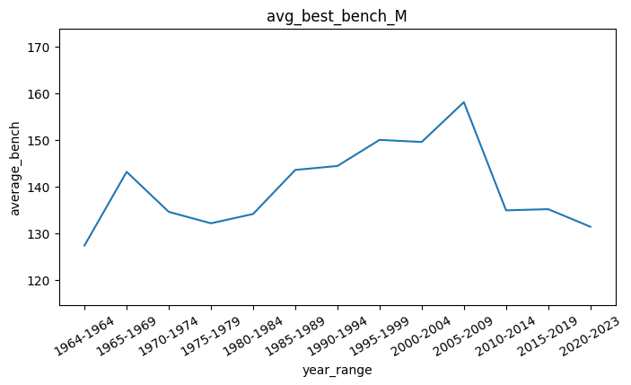

#### Average Best Bench for Female <a name=avg_bench_female></a>
```sql
SELECT
    year_range,
    average_bench
FROM avg_best_bench
WHERE sex = 'F'
ORDER BY year_range;
```
Output:
|year_range|average_bench|
|----------|-------------|
|1975-1979 |47.09        |
|1980-1984 |54.30        |
|1985-1989 |64.60        |
|1990-1994 |67.23        |
|1995-1999 |71.59        |
|2000-2004 |73.59        |
|2005-2009 |75.39        |
|2010-2014 |64.52        |
|2015-2019 |61.61        |
|2020-2023 |64.81        |


#### Average Best Bench for Neutral Gender <a name=avg_bench_neutral></a>
```sql
SELECT
    year_range,
    average_bench
FROM avg_best_bench
WHERE sex = 'Mx'
ORDER BY year_range;
```
Output:
|year_range|average_bench|
|----------|-------------|
|2016-2019 |68.59        |
|2020-2023 |60.47        |

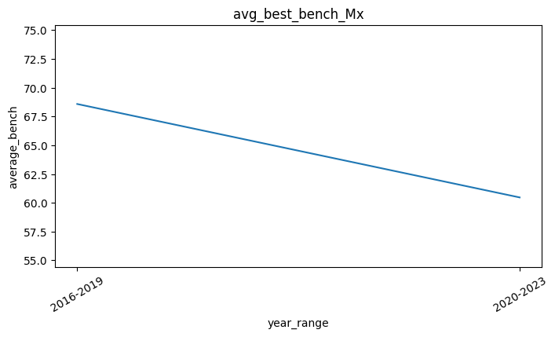

### Average Best Deadlift <a name=avg_deadlift></a>
```sql
CREATE TABLE avg_best_deadlift(
    year_range VARCHAR,
    sex VARCHAR,
    average_deadlift NUMERIC
);

INSERT INTO avg_best_deadlift(
    year_range,
    sex,
    average_deadlift
)

SELECT
    CONCAT(MIN(DATE_PART('year', date))::VARCHAR, '-', MAX(DATE_PART('year', date))::VARCHAR) AS year_range,
    sex,
    ROUND(AVG(best3deadliftkg), 2) AS average_deadlift
FROM powerlift_data
WHERE
    best3deadliftkg > 0
GROUP BY
    FLOOR(DATE_PART('year', date)/5),
    sex;
```
Output:
> INSERT successfully executed. 25 rows were affected.

#### Average Best Deadlift for Male <a name=avg_deadlift_male></a>
```sql
SELECT
    year_range,
    average_deadlift
FROM avg_best_deadlift
WHERE sex = 'M'
ORDER BY year_range;
```
Output:
|year_range|average_deadlift|
|----------|----------------|
|1964-1964 |238.46          |
|1965-1969 |241.39          |
|1970-1974 |232.62          |
|1975-1979 |222.92          |
|1980-1984 |220.25          |
|1985-1989 |232.56          |
|1990-1994 |230.77          |
|1995-1999 |230.26          |
|2000-2004 |225.93          |
|2005-2009 |225.78          |
|2010-2014 |201.58          |
|2015-2019 |211.99          |
|2020-2023 |213.51          |

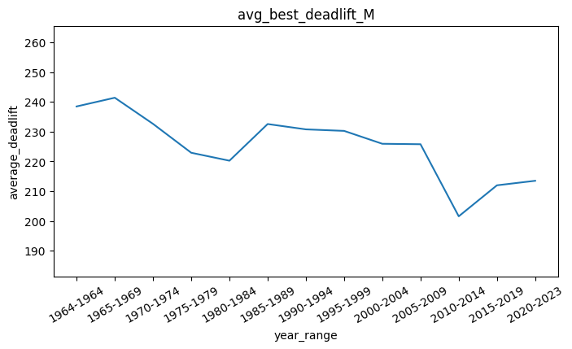

#### Average Best Deadlift for Female <a name=avg_deadlift_female></a>
```sql
SELECT
    year_range,
    average_deadlift
FROM avg_best_deadlift
WHERE sex = 'F'
ORDER BY year_range;
```
Output:
|year_range|average_deadlift|
|----------|----------------|
|1975-1979 |112.73          |
|1980-1984 |123.76          |
|1985-1989 |138.71          |
|1990-1994 |138.53          |
|1995-1999 |139.25          |
|2000-2004 |137.00          |
|2005-2009 |134.97          |
|2010-2014 |123.86          |
|2015-2019 |125.46          |
|2020-2023 |131.60          |

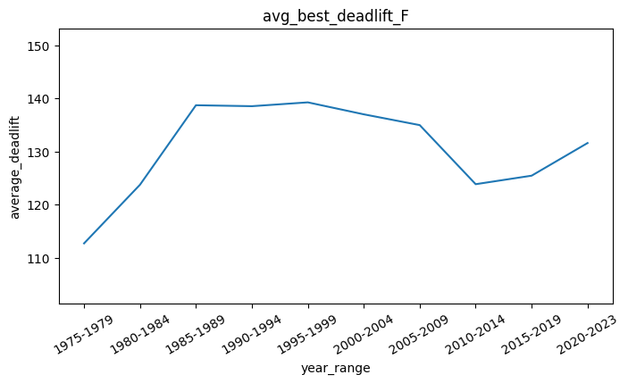

#### Average Best Deadlift for Neutral Gender <a name=avg_deadlift_neutral></a>
```sql
SELECT
    year_range,
    average_deadlift
FROM avg_best_deadlift
WHERE sex = 'Mx'
ORDER BY year_range;
```
Output:
|year_range|average_deadlift|
|----------|----------------|
|2017-2019 |132.99          |
|2020-2023 |126.29          |

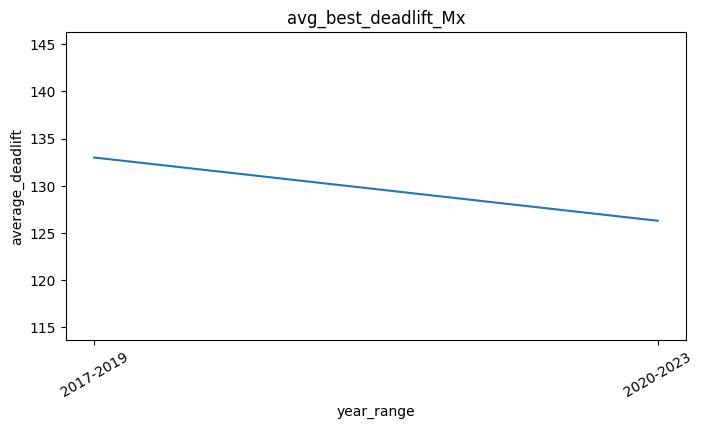

## TEMPORARY ARCHIVED

First, we will create table that contains all successful lift and replace failed lift with `NULL` value. Now, we will try to use temporary table called `successful_lift` instead of CTE method.

```sql
CREATE TABLE success_lift (
name VARCHAR,
sex VARCHAR,
date DATE,
event VARCHAR,
Squat1Kg NUMERIC,
Squat2Kg NUMERIC,
Squat3Kg NUMERIC,
Squat4Kg NUMERIC,
Best3SquatKg NUMERIC,
Bench1Kg NUMERIC,
Bench2Kg NUMERIC,
Bench3Kg NUMERIC,
Bench4Kg NUMERIC,
Best3BenchKg NUMERIC,
Deadlift1Kg NUMERIC,
Deadlift2Kg NUMERIC,
Deadlift3Kg NUMERIC,
Deadlift4Kg NUMERIC,
Best3DeadliftKg NUMERIC
);

INSERT INTO success_lift(
name,
sex,
date,
event,
Squat1Kg,
Squat2Kg,
Squat3Kg,
Squat4Kg,
Best3SquatKg,
Bench1Kg,
Bench2Kg,
Bench3Kg,
Bench4Kg,
Best3BenchKg,
Deadlift1Kg,
Deadlift2Kg,
Deadlift3Kg,
Deadlift4Kg,
Best3DeadliftKg
)
SELECT
name,
sex,
date,
event,
Squat1Kg,
Squat2Kg,
Squat3Kg,
Squat4Kg,
Best3SquatKg,
Bench1Kg,
Bench2Kg,
Bench3Kg,
Bench4Kg,
Best3BenchKg,
Deadlift1Kg,
Deadlift2Kg,
Deadlift3Kg,
Deadlift4Kg,
Best3DeadliftKg
FROM powerlift_data;
```
Output:
> INSERT successfully executed. 2855892 rows were affected.

Next, we will replace the failed lift with `NULL` value.
```sql
UPDATE success_lift SET squat1kg = NULL WHERE squat1kg < 0;

UPDATE success_lift SET squat2kg = NULL WHERE squat2kg < 0;

UPDATE success_lift SET squat3kg = NULL WHERE squat3kg < 0;

UPDATE success_lift SET squat4kg = NULL WHERE squat4kg < 0;

UPDATE success_lift SET best3squatKg = NULL WHERE best3squatKg < 0;

UPDATE success_lift SET bench1kg = NULL WHERE bench1kg < 0;

UPDATE success_lift SET bench2kg = NULL WHERE bench2kg < 0;

UPDATE success_lift SET bench3kg = NULL WHERE bench3kg < 0;

UPDATE success_lift SET bench4kg = NULL WHERE bench4kg < 0;

UPDATE success_lift SET best3benchkg = NULL WHERE best3benchkg < 0;

UPDATE success_lift SET deadlift1kg = NULL WHERE deadlift1kg < 0;

UPDATE success_lift SET deadlift2kg = NULL WHERE deadlift2kg < 0;

UPDATE success_lift SET deadlift3Kg = NULL WHERE deadlift3kg < 0;

UPDATE success_lift SET deadlift4kg = NULL WHERE deadlift4kg < 0;

UPDATE success_lift SET Best3deadliftKg = NULL WHERE best3deadliftkg < 0;
```
Output:
> UPDATE successfully executed. xxx rows were affected.