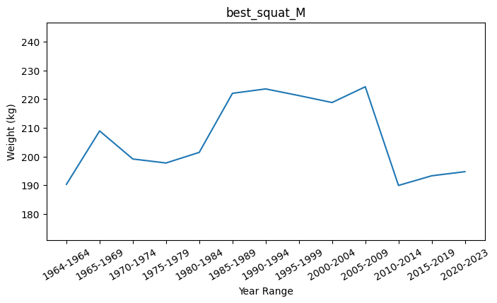
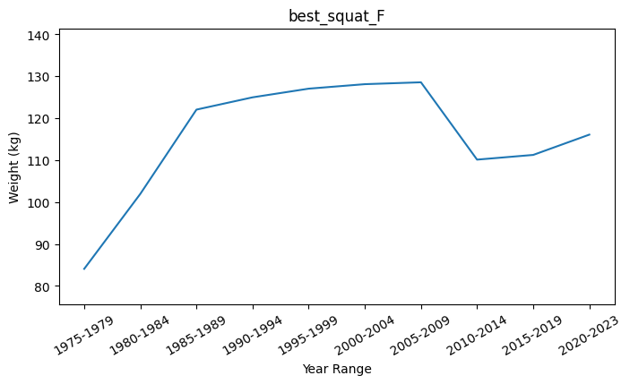
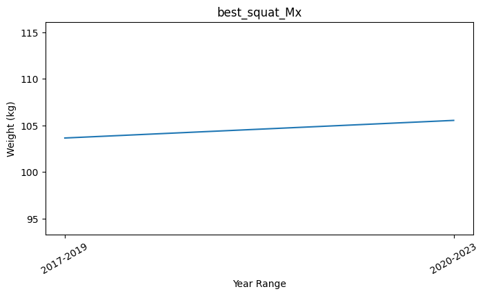
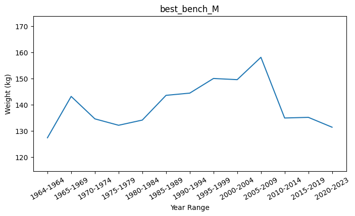
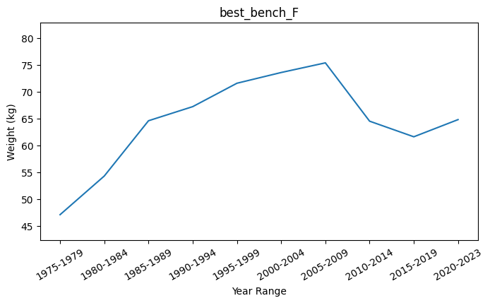
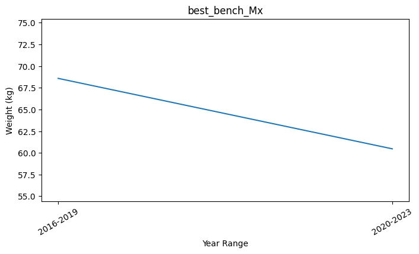
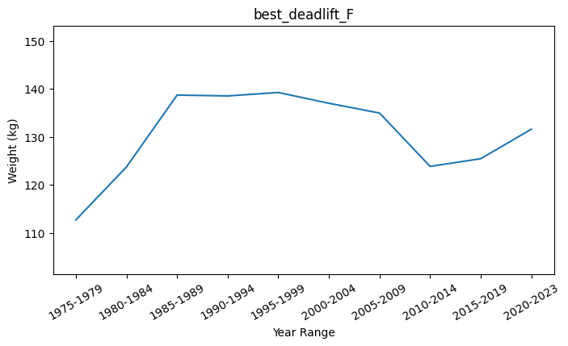
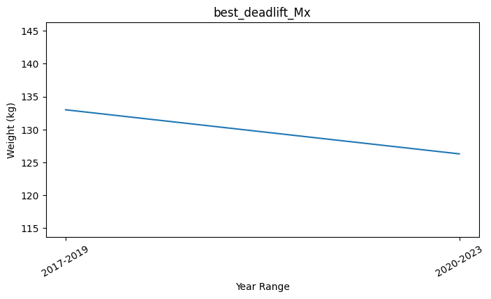

# Case Study <a name=case_study></a>
1. Percentage of powerlifter's gender.

    Because some participants name occurs more than one, first we query the unique participant `name` and their `sex`, after that we use `COUNT(*)`.
    ```sql
    WITH
    unique_participants AS (
        SELECT
            DISTINCT name,
            sex
        FROM powerlift_data
    ),
    unique_gender AS (
        SELECT
            sex,
            COUNT(*) AS count_gender
        FROM unique_participants
        GROUP BY sex
    )

    SELECT
        sex,
        ROUND(count_gender / SUM(count_gender) OVER() * 100, 3) AS percentage
    FROM unique_gender
    ORDER BY percentage DESC;
    ```
    Output:
    |sex|percentage|
    |---|---|
    |M|75.171|
    |F|24.826|
    |Mx|0.004|

2. Percentage of each event respectively to the total event.
    ```sql
    WITH
    unique_event AS (
        SELECT
            event,
            COUNT(*) AS count_event
        FROM powerlift_data
        GROUP BY event
    )

    SELECT
        event,
        count_event,
        ROUND(count_event / SUM(count_event) OVER() * 100, 3) AS percentage
    FROM unique_event
    ORDER BY percentage DESC;
    ```
    Output:
    |event|count_event|percentage|
    |-----|-----------|----------|
    |SBD  |1970821    |69.009    |
    |B    |645043     |22.586    |
    |D    |164047     |5.744     |
    |BD   |56006      |1.961     |
    |S    |15233      |0.533     |
    |SB   |2922       |0.102     |
    |SD   |1820       |0.064     |

3. How many percent successful lift in SBD (for each lift)?

    First, we create table called `success_lift` that contains lift name followed by lift percentage, then we will query each lift, one by one, and insert it into the table.

    ```sql
    CREATE TABLE lift_percentage (
        lift VARCHAR,
        lift_1_percent NUMERIC,
        lift_2_percent NUMERIC,
        lift_3_percent NUMERIC
    );
    ```
    Output:
    > CREATE successfully executed.

    **Squat**
    ```sql
    INSERT INTO lift_percentage(
        lift,
        lift_1_percent,
        lift_2_percent,
        lift_3_percent
    )
    WITH
    sbd_squat AS (
        SELECT
            squat1kg,
            squat2kg,
            squat3kg
        FROM powerlift_data
        WHERE event = 'SBD'
    )
    SELECT
        'squat' AS lift,
        ROUND(
            (SELECT
                COUNT(squat1kg) FROM sbd_squat WHERE squat1kg > 0
            ) / COUNT(squat1kg)::NUMERIC*100, 2
        ) AS lift_1_percent,
        
        ROUND(
            (SELECT
                COUNT(squat2kg) FROM sbd_squat WHERE squat2kg > 0
            ) / COUNT(squat2kg)::NUMERIC*100, 2
        ) AS lift_2_percent,

        ROUND(
            (SELECT
                COUNT(squat3kg) FROM sbd_squat WHERE squat3kg > 0
            ) / COUNT(squat3kg)::NUMERIC*100, 2
        ) AS lift_3_percent
    FROM sbd_squat;
    ```
    Output:
    > INSERT successfully executed. 1 rows were affected.

    **Bench**
    ```sql
    INSERT INTO lift_percentage(
        lift,
        lift_1_percent,
        lift_2_percent,
        lift_3_percent
    )
    WITH
    sbd_bench AS (
        SELECT
            bench1kg,
            bench2kg,
            bench3kg
        FROM powerlift_data
        WHERE event = 'SBD'
    )
    SELECT
        'bench' AS lift,
        ROUND(
            (SELECT
                COUNT(bench1kg) FROM sbd_bench WHERE bench1kg > 0
            ) / COUNT(bench1kg)::NUMERIC*100, 2
        ) AS lift_1_percent,
        
        ROUND(
            (SELECT
                COUNT(bench2kg) FROM sbd_bench WHERE bench2kg > 0
            ) / COUNT(bench2kg)::NUMERIC*100, 2
        ) AS lift_2_percent,

        ROUND(
            (SELECT
                COUNT(bench3kg) FROM sbd_bench WHERE bench3kg > 0
            ) / COUNT(bench3kg)::NUMERIC*100, 2
        ) AS lift_3_percent
    FROM sbd_bench;
    ```
    Output:
    > INSERT successfully executed. 1 rows were affected.

    **Deadlift**
    ```sql
    INSERT INTO lift_percentage(
        lift,
        lift_1_percent,
        lift_2_percent,
        lift_3_percent
    )
    WITH
    sbd_deadlift AS (
        SELECT
            deadlift1kg,
            deadlift2kg,
            deadlift3kg
        FROM powerlift_data
        WHERE event = 'SBD'
    )
    SELECT
        'deadlift' AS lift,
        ROUND(
            (SELECT
                COUNT(deadlift1kg) FROM sbd_deadlift WHERE deadlift1kg > 0
            ) / COUNT(deadlift1kg)::NUMERIC*100, 2
        ) AS lift_1_percent,
        
        ROUND(
            (SELECT
                COUNT(deadlift2kg) FROM sbd_deadlift WHERE deadlift2kg > 0
            ) / COUNT(deadlift2kg)::NUMERIC*100, 2
        ) AS lift_2_percent,

        ROUND(
            (SELECT
                COUNT(deadlift3kg) FROM sbd_deadlift WHERE deadlift3kg > 0
            ) / COUNT(deadlift3kg)::NUMERIC*100, 2
        ) AS lift_3_percent
    FROM sbd_deadlift;
    ```
    Output:
    > INSERT successfully executed. 1 rows were affected.

    ```sql
    SELECT *
    FROM lift_percentage;
    ```
    Output:
    |lift|lift_1_percent|lift_2_percent|lift_3_percent|
    |----|--------------|--------------|--------------|
    |squat|85.19         |78.79         |61.87         |
    |bench|89.60         |77.04         |45.85         |
    |deadlift|94.53         |85.92         |58.68         |
    
    All successful lift decrease proportionally to the lift attempt.

4. How much is the average best lift for each 5 year (for each lift)?

    First, we will query for each lift and export it into [query_csv](query_csv), then we will plot it by using [plot_best_average script](plot_best_average.py) and save it into [plot_graph](plot_graph).

    **Average Best Squat**
    ```sql
    SELECT
        CONCAT(MIN(DATE_PART('year', date))::VARCHAR, '-', MAX(DATE_PART('year', date))::VARCHAR) AS year_range,
        sex,
        ROUND(AVG(best3squatkg), 2) AS average_squat
    FROM powerlift_data
    WHERE
        best3squatkg > 0
    GROUP BY
        FLOOR(DATE_PART('year', date)/5),
        sex
    ORDER BY
        year_range,
        sex
    ```
    Output:
    |year_range|sex|average_squat|
    |----------|---|-------------|
    |1964-1964 |M  |190.29       |
    |1965-1969 |M  |208.90       |
    |1970-1974 |M  |199.12       |
    |1975-1979 |F  |84.07        |
    |1975-1979 |M  |197.73       |
    |1980-1984 |F  |101.96       |
    |1980-1984 |M  |201.43       |
    |1985-1989 |F  |122.06       |
    |1985-1989 |M  |222.01       |
    |1990-1994 |F  |124.99       |
    |1990-1994 |M  |223.54       |
    |1995-1999 |F  |127.06       |
    |1995-1999 |M  |221.22       |
    |2000-2004 |F  |128.13       |
    |2000-2004 |M  |218.80       |
    |2005-2009 |F  |128.58       |
    |2005-2009 |M  |224.29       |
    |2010-2014 |F  |110.13       |
    |2010-2014 |M  |189.90       |
    |2015-2019 |F  |111.25       |
    |2015-2019 |M  |193.27       |
    |2017-2019 |Mx |103.66       |
    |2020-2023 |F  |116.09       |
    |2020-2023 |M  |194.70       |
    |2020-2023 |Mx |105.55       |

    

    

    
    
    **Average Best Bench**
    ```sql
    SELECT
        CONCAT(MIN(DATE_PART('year', date))::VARCHAR, '-', MAX(DATE_PART('year', date))::VARCHAR) AS year_range,
        sex,
        ROUND(AVG(best3benchkg), 2) AS average_bench
    FROM powerlift_data
    WHERE
        best3benchkg > 0
    GROUP BY
        FLOOR(DATE_PART('year', date)/5),
        sex
    ORDER BY
        year_range,
        sex
    ```
    Output:
    |year_range|sex|average_bench|
    |----------|---|-------------|
    |1964-1964 |M  |127.32       |
    |1965-1969 |M  |143.14       |
    |1970-1974 |M  |134.55       |
    |1975-1979 |F  |47.09        |
    |1975-1979 |M  |132.10       |
    |1980-1984 |F  |54.30        |
    |1980-1984 |M  |134.09       |
    |1985-1989 |F  |64.60        |
    |1985-1989 |M  |143.55       |
    |1990-1994 |F  |67.23        |
    |1990-1994 |M  |144.40       |
    |1995-1999 |F  |71.59        |
    |1995-1999 |M  |150.00       |
    |2000-2004 |F  |73.59        |
    |2000-2004 |M  |149.55       |
    |2005-2009 |F  |75.39        |
    |2005-2009 |M  |158.10       |
    |2010-2014 |F  |64.52        |
    |2010-2014 |M  |134.88       |
    |2015-2019 |F  |61.61        |
    |2015-2019 |M  |135.13       |
    |2016-2019 |Mx |68.59        |
    |2020-2023 |F  |64.81        |
    |2020-2023 |M  |131.36       |
    |2020-2023 |Mx |60.47        |

    

    

    

    **Average Best Deadlift**
    ```sql
    SELECT
        CONCAT(MIN(DATE_PART('year', date))::VARCHAR, '-', MAX(DATE_PART('year', date))::VARCHAR) AS year_range,
        sex,
        ROUND(AVG(best3deadliftkg), 2) AS average_deadlift
    FROM powerlift_data
    WHERE
        best3deadliftkg > 0
    GROUP BY
        FLOOR(DATE_PART('year', date)/5),
        sex
    ORDER BY
        year_range,
        sex
    ```
    Output:
    |year_range|sex|average_deadlift|
    |----------|---|----------------|
    |1964-1964 |M  |238.46          |
    |1965-1969 |M  |241.39          |
    |1970-1974 |M  |232.62          |
    |1975-1979 |F  |112.73          |
    |1975-1979 |M  |222.92          |
    |1980-1984 |F  |123.76          |
    |1980-1984 |M  |220.25          |
    |1985-1989 |F  |138.71          |
    |1985-1989 |M  |232.56          |
    |1990-1994 |F  |138.53          |
    |1990-1994 |M  |230.77          |
    |1995-1999 |F  |139.25          |
    |1995-1999 |M  |230.26          |
    |2000-2004 |F  |137.00          |
    |2000-2004 |M  |225.93          |
    |2005-2009 |F  |134.97          |
    |2005-2009 |M  |225.78          |
    |2010-2014 |F  |123.86          |
    |2010-2014 |M  |201.58          |
    |2015-2019 |F  |125.46          |
    |2015-2019 |M  |211.99          |
    |2017-2019 |Mx |132.99          |
    |2020-2023 |F  |131.60          |
    |2020-2023 |M  |213.51          |
    |2020-2023 |Mx |126.29          |

    

    

    

## TEMPORARY ARCHIVED

First, we will create table that contains all successful lift and replace failed lift with `NULL` value. Now, we will try to use temporary table called `successful_lift` instead of CTE method.

```sql
CREATE TABLE success_lift (
    name VARCHAR,
    sex VARCHAR,
    date DATE,
    event VARCHAR,
    Squat1Kg NUMERIC,
    Squat2Kg NUMERIC,
    Squat3Kg NUMERIC,
    Squat4Kg NUMERIC,
    Best3SquatKg NUMERIC,
    Bench1Kg NUMERIC,
    Bench2Kg NUMERIC,
    Bench3Kg NUMERIC,
    Bench4Kg NUMERIC,
    Best3BenchKg NUMERIC,
    Deadlift1Kg NUMERIC,
    Deadlift2Kg NUMERIC,
    Deadlift3Kg NUMERIC,
    Deadlift4Kg NUMERIC,
    Best3DeadliftKg NUMERIC
);

INSERT INTO success_lift(
    name,
    sex,
    date,
    event,
    Squat1Kg,
    Squat2Kg,
    Squat3Kg,
    Squat4Kg,
    Best3SquatKg,
    Bench1Kg,
    Bench2Kg,
    Bench3Kg,
    Bench4Kg,
    Best3BenchKg,
    Deadlift1Kg,
    Deadlift2Kg,
    Deadlift3Kg,
    Deadlift4Kg,
    Best3DeadliftKg
)
SELECT
    name,
    sex,
    date,
    event,
    Squat1Kg,
    Squat2Kg,
    Squat3Kg,
    Squat4Kg,
    Best3SquatKg,
    Bench1Kg,
    Bench2Kg,
    Bench3Kg,
    Bench4Kg,
    Best3BenchKg,
    Deadlift1Kg,
    Deadlift2Kg,
    Deadlift3Kg,
    Deadlift4Kg,
    Best3DeadliftKg
FROM powerlift_data;
```
Output:
> INSERT successfully executed. 2855892 rows were affected.

Next, we will replace the failed lift with `NULL` value.
```sql
UPDATE success_lift SET squat1kg = NULL WHERE squat1kg < 0;

UPDATE success_lift SET squat2kg = NULL WHERE squat2kg < 0;

UPDATE success_lift SET squat3kg = NULL WHERE squat3kg < 0;

UPDATE success_lift SET squat4kg = NULL WHERE squat4kg < 0;

UPDATE success_lift SET best3squatKg = NULL WHERE best3squatKg < 0;

UPDATE success_lift SET bench1kg = NULL WHERE bench1kg < 0;

UPDATE success_lift SET bench2kg = NULL WHERE bench2kg < 0;

UPDATE success_lift SET bench3kg = NULL WHERE bench3kg < 0;

UPDATE success_lift SET bench4kg = NULL WHERE bench4kg < 0;

UPDATE success_lift SET best3benchkg = NULL WHERE best3benchkg < 0;

UPDATE success_lift SET deadlift1kg = NULL WHERE deadlift1kg < 0;

UPDATE success_lift SET deadlift2kg = NULL WHERE deadlift2kg < 0;

UPDATE success_lift SET deadlift3Kg = NULL WHERE deadlift3kg < 0;

UPDATE success_lift SET deadlift4kg = NULL WHERE deadlift4kg < 0;

UPDATE success_lift SET Best3deadliftKg = NULL WHERE best3deadliftkg < 0;
```
Output:
> UPDATE successfully executed. xxx rows were affected.